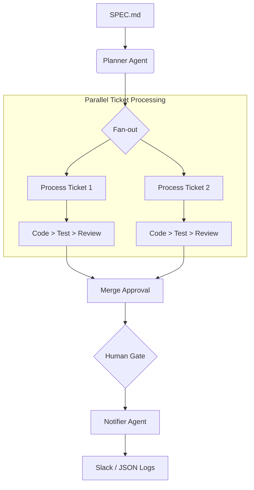

# 🚀 Agentic Dev Pipeline

**Automate your software development lifecycle with multi-agent orchestration.**

# Idea from Boris Cherny (Claude code creator): https://x.com/rvivek/status/2026385957596111044


[](https://www.python.org/downloads/)
[](https://opensource.org/licenses/MIT)
[](https://github.com/langchain-ai/langgraph)
[](https://github.com/joaomdmoura/crewai)

Agentic Dev Pipeline is a stateful, multi-agent system designed to automate ticket planning, parallel coding, automated testing, and code review. It transforms a high-level `SPEC.md` into fully implemented, tested, and reviewed pull requests.

---

## ✨ Key Features

-   **🧠 Intelligent Planning**: Automatically decomposes specifications into actionable Asana tickets.
-   **⚡ Parallel Implementation**: Orchestrates multiple coding agents to work on independent tasks concurrently.
-   **🧪 Automated QA**: Each branch is automatically tested with `pytest` and coverage reports are generated.
-   **🔍 AI-Powered Review**: PRs are audited for diff size, linting (`ruff`), and coverage deltas.
-   **⏸️ Human-in-the-Loop**: A secure gate ensures critical merges only happen after explicit human approval.
-   **📢 Real-time Notifications**: Keeps the team updated via structured Slack messages.

---

## 🏗️ Architecture

The pipeline is orchestrated by **LangGraph**, providing a stateful workflow. It uses a fan-out pattern to process multiple tickets in parallel.



For a deep dive into the system design, see [architecture.md](./architecture.md).

---

## 🚀 Quick Start

### 1. Prerequisites
- Python 3.11+
- [Make](https://www.gnu.org/software/make/) (optional)

### 2. Installation
```bash
git clone https://github.com/your-username/agentic-dev-pipeline.git
cd agentic-dev-pipeline
python -m venv venv
source venv/bin/activate  # Windows: .\venv\Scripts\activate
pip install -e ".[dev]"
```

### 3. Configuration
1. Copy the example environment file:
   - **Unix/macOS**: `cp .env.example .env`
   - **Windows**: `copy .env.example .env`
2. Fill in your API keys for **Anthropic**, **Asana**, **GitHub**, and **Slack** in the `.env` file. Refer to the [Setup Guide](./to-do-list.md) for detailed instructions.

### 4. Running the Pipeline
```bash
# Dry run (no API costs, uses mock agents & robust JSON parsing)
python -m pipeline.graph.pipeline_graph --spec SPEC.md

# Live run
# 1. Update .env -> DRY_RUN=false
# 2. Run via Make or direct command
make run  # or python -m pipeline.graph.pipeline_graph --spec SPEC.md
```

---

## 🛠️ Development

### 👷 Local Setup
To set up a local development environment with all dev tools:
```bash
pip install -e ".[dev]"
```

### 📂 Project Structure
- `pipeline/agents/`: Individual agent definitions (Planner, Coder, etc.).
- `pipeline/tools/`: Custom tools for GitHub, Asana, Slack.
- `pipeline/graph/`: LangGraph orchestration and state schema.
- `tests/`: Unit tests and helpers.
- `logs/`: Structured JSONL execution logs generated during runs.

### 🧩 Extending the Pipeline
- **Add an Agent**: Create a new file in `pipeline/agents/` and export it in `__init__.py`.
- **Add a Tool**: Implement a new tool in `pipeline/tools/` using CrewAI or LangChain `BaseTool`.
- **Modify Workflow**: Update `pipeline/graph/pipeline_graph.py` to add new nodes or edges.

### 📏 Standards
- **Linting**: We use **Ruff**. Run `make lint` or `py -m ruff check .`
- **Testing**: We use **pytest**. Run `make test` or `py -m pytest tests/`
- **Formatting**: Ensure your code follows the shared `pyproject.toml` rules.

### 🧹 Cleanup
To remove caches and local logs:
```bash
make clean
```

---

## 🤝 Contributing

We welcome contributions! Please see our [CONTRIBUTING.md](./CONTRIBUTING.md) for details on how to get started.

---

## 📄 License

This project is licensed under the MIT License - see the [LICENSE](./LICENSE) file for details.

---

## 🙏 Acknowledgments

-   Built with [CrewAI](https://www.crewai.com/)
-   Orchestrated with [LangGraph](https://www.langchain.com/langgraph)
-   Inspired by modern DevOps best practices.
