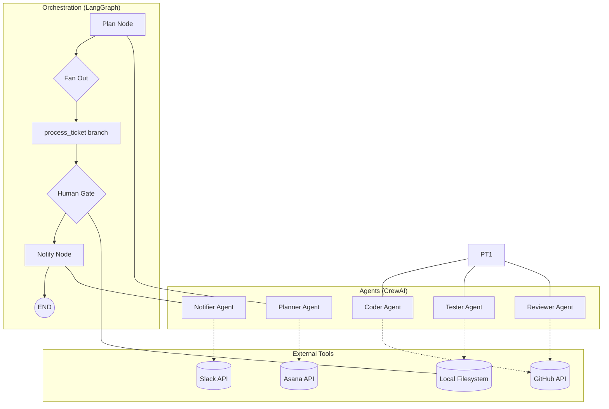

# 🏗️ Agentic Dev Pipeline - Architecture

This document describes the high-level architecture and data flow of the Agentic Dev Pipeline.

## 🗺️ System Overview

The system uses a multi-agent approach orchestrated by **LangGraph** to manage the software development lifecycle.

## 🧩 Key Components

### 1. Agents (CrewAI)
- **Planner**: Decomposes `SPEC.md` into discrete tickets.
- **Coder**: Implements specific tickets on feature branches and opens PRs.
- **Tester**: Runs `pytest` with coverage and reports results.
- **Reviewer**: Audits PR diffs for quality, size, and lint errors.
- **Notifier**: Aggregates results and posts a summary to Slack.

### 2. Orchestration (LangGraph)
- **State Management**: Uses a `TypedDict` to track ticket status and results across the entire run.
- **Parallelism**: Uses the `Send` API to execute per-ticket branches concurrently.
- **Persistence**: Supports checkpointing for long-running workflows and human intervention.

### 3. State Schema (`PipelineState`)
- `spec_path`: Path to the input requirement file.
- `tickets`: List of all identified tasks and their metadata.
- `completed_tickets`: List of successfully processed tickets (aggregated via `operator.add`).
- `failed_tickets`: List of tickets that failed execution or review.
- `human_approved`: Boolean flag for the final merge gate.

## 🔄 Data Flow

1.  **Ingestion**: `SPEC.md` is read by the Planner.
2.  **Topological Sort**: Tickets are created in Asana with dependency links.
3.  **Parallel Execution**: langGraph spawns a branch for every "ready" ticket.
4.  **Looping**: Review failures trigger retries (capped at 3).
5.  **Gating**: The pipeline pauses before final notification, awaiting human validation of the work.
6.  **Reporting**: Final status is logged to JSONL and sent to the team via Slack.
